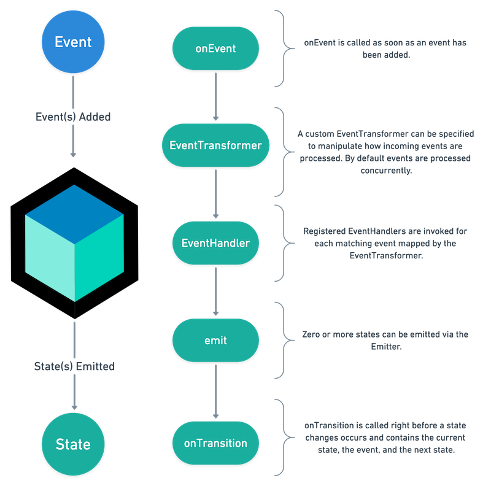
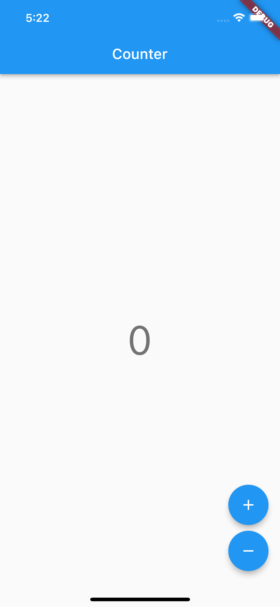
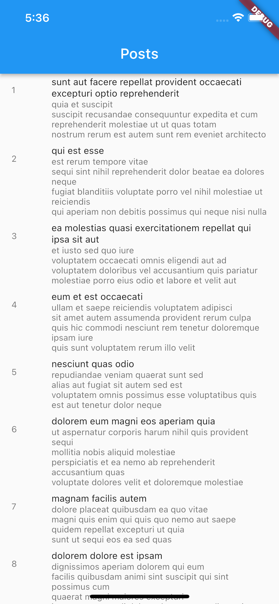
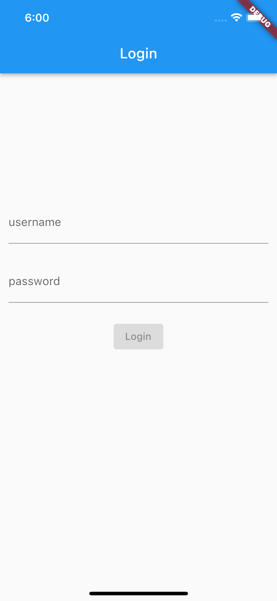

<div id="top"></div>

<!-- PROJECT LOGO -->
<br />
<div align="center">
  
  <p>
    Learnings from a couple Bloc tutorials!
  </p>
</div>


<!-- TABLE OF CONTENTS -->
<details>
  <summary>Table of Contents</summary>
  <ol>
    <li>
      <a href="#about-the-project">About The Project</a>
      <ul>
        <li><a href="#built-with">Built With</a></li>
        <li><a href="#introduction">Introduction</a></li>
        <li><a href="#bloc-widgets">Bloc Widgets</a></li>
        <li><a href="#using-bloc">Using Bloc</a></li>
        <li><a href="#tutorials-attempted">Tutorials Attempted</a></li>
      </ul>
    </li>
    <li>
      <a href="#getting-started">Getting Started</a>
      <ul>
        <li><a href="#prerequisites">Prerequisites</a></li>
        <li><a href="#how-to-use">How to use</a></li>
      </ul>
    </li>
    <li>
      <a href="#tutorials">Tutorials</a>
      <ul>
        <li><a href="#counter">Counter</a></li>
        <li><a href="#infinite-list">Infinite List</a></li>
        <li><a href="#login">Login</a></li>
      </ul>
    </li>
    <li><a href="#contributing">Contributing</a></li>
<!--     <li><a href="#acknowledgments">Acknowledgments</a></li> -->
  </ol>
</details>


<!-- ABOUT THE PROJECT -->
## About The Project

### Built With

* [Flutter](https://docs.flutter.dev/)
* [Bloc](https://bloclibrary.dev/#/)

<p align="right">(<a href="#top">back to top</a>)</p>

### Introduction
<div>
  
</div>
<div>
  <ul>
    <li>Bloc stands for Business Logic Component</li>
    <li>
      Bloc pattern consists of
      <ul>
        <li>Event</li>
        <li>Bloc</li>
        <li>Stream</li>
      </ul>
    </li>
    <li>Whereby an Event is triggered by a user action which gets dispatched to a bloc and emitted as a stream (sequence of async data) which can be used in a StreamBuilder or the UI is rebuild by the BlocBuilder each time the state changes</li>
    <li>
      Each widget has its own Bloc which defines
      <ul>
        <li>The initial state</li>
        <li>A reducer function which takes in the current state and event, and looks at the event itself to determine how to reduce the next state based on that event</li>
        <li>Simply, events are the input to a Bloc and states are the output of a Bloc; Events are dispatched and then converted to States</li>
      </ul>
    </li>
    <li>Presentation components can listen to the stream of states and redraw themselves based on the given state (BlocBuilder)</li>
    <li>Good separation of concerns as the UI widgets are only concerned with rendering the UI and dispatching actions and does not contain or perform any business logic</li>
  </ul>
</div>

<p align="right">(<a href="#top">back to top</a>)</p>

### Bloc Widgets
| Widgets | Description |
| ------------------------ | ----------------------------------------------------------- |
| BlocProvider | BlocProvider itself extends an InheritedWidget and provides a Bloc to its children, where they will be able to access the state and the data contained inside the Bloc | 
| BlocListener | BlocListener listens to the different states that would be emitted from Bloc and react to them (does not rebuild the UI) | 
| BlocBuilder | BlocBuilder takes the Bloc as an argument and accesses the current state inside of this function and rebuilds the UI each time the state changes | 

<p align="right">(<a href="#top">back to top</a>)</p>

### Using Bloc
1.	Define the different states Bloc will be emitting
2.	Define the different events Bloc will be reacting to
3.	Define Bloc’s initial state and functions which converts the incoming events into states that are consumed by the presentation layer

<p align="right">(<a href="#top">back to top</a>)</p>

### Tutorials Attempted 
* Counter
* Infinite List
* Login

<div>
  
  
  
</div>
<p align="right">(<a href="#top">back to top</a>)</p>

<!-- GETTING STARTED -->
## Getting Started

### Prerequisites
* Flutter 2.10.2
* Dart 2.16.1
* Xcode 13.2.1

Run `flutter doctor` in the terminal to check if you are using the same versions
```bash
$ flutter doctor
Doctor summary (to see all details, run flutter doctor -v):
[✓] Flutter (Channel stable, 2.10.2, on macOS 11.6.5 20G527 darwin-x64, locale
    en-SG)
[✓] Android toolchain - develop for Android devices (Android SDK version 31.0.0)
[✓] Xcode - develop for iOS and macOS (Xcode 13.2.1)
[✓] Chrome - develop for the web
[✓] Android Studio (version 2020.3)
[✓] VS Code (version 1.66.2)
[✓] Connected device (1 available)
[✓] HTTP Host Availability

• No issues found!
```
### How to use
From the root of the project, run `flutter pub get` to retrieve the dependencies
```bash
$ flutter pub get
```

Run `open -a simulator` to launch the ios emulator
```bash
$ open -a simulator
```

Run `flutter run` to start the project
```bash
$ flutter run
```
<p align="right">(<a href="#top">back to top</a>)</p>

## Tutorials
### Counter
Overview
* BlocObserver
* Cubit vs Bloc

| Cubit | Bloc |
| ------------------------ | ----------------------------------------------------------- |
| When creating a Cubit, we have to define the state and the functions to trigger state changes | When creating a Bloc, we have to define the state, event and event handler |
| Simpler as less code is involved | More traceable as we know the event that triggered those changes |

Learnings
<div>
  <ul>
    <li>
      CounterCubit
      <ul>
        <li>Does not specify the event that triggers the function for the state to change, rather it only exposes the function to emit the new changes</li>
        <li>Can be good if only one event is responsible for a widget to redraw and state change does not require complex logic</li>
      </ul>
    </li>
    <li>
      CounterView
      <ul>
        <li>Button press does not dispatch an event to the intermediary to decide how to change the state but rather it calls the CounterCubit methods straight which immediately accesses and outputs the new state</li>
      </ul>
    </li>
    <li>
      BlocObserver
      <ul>
        <li>Responds to all changes even if there are more than one Cubit across the App managing different states, such as handling all reported errors globally</li>
        <li>Created at the root widget</li>
      </ul>
    </li>
  </ul>
</div>

<p align="right">(<a href="#top">back to top</a>)</p>


### Infinite List
Overview
* Equatable
* Adding events
* Defining states
* Transition

Learnings
<div>
  <ul>
    <li>
      PostBloc
      <ul>
        <li>Responds to PostFetched, which is a type of PostEvent, using an event handler</li>
        <li>Emits the PostStates which tells the presentation layer what to do</li>
        <li>PostEvent and PostState extends Equatable so that we can directly compare states and not rebuild the widget if the same state occurs; objects with the same value have different hashcode internally</li>
      </ul>
    </li>
    <li>
      PostsPage
      <ul>
        <li>Contains an instance of PostBloc that adds PostFetched event which triggers on creation and renders PostsList</li>
      </ul>
    </li>
    <li>
      PostsList
      <ul>
        <li>Uses a BlocBuilder to rebuild the view depending on the state, and is hooked up to PostBloc and adds a PostFetched event when it reaches the bottom of the scroll</li>
        <li>Instead of using switch case, can also try using buildWhen() which rebuilds the view when the current state is PostStatus.success</li>
      </ul>
    </li>
    <li>
      BlocObserver
      <ul>
        <li>onTransition can be used in BlocObserver to log the changes in state</li>
      </ul>
    </li>
  </ul>
</div>

<p align="right">(<a href="#top">back to top</a>)</p>


### Login
Overview
* Stream
* RepositoryProvider

Learnings
<div>
  <ul>
    <li>
      UserRepository
      <ul>
        <li>Exposes a method getUser() which will retrieve the current user</li>
        <li>Wrapped with RepositoryProvider to provide a repository for all the Blocs</li>
      </ul>
    </li>
    <li>
      AuthenticationRepository
      <ul>
        <li>Exposes a stream of AuthenticationStatus updates</li>
        <li>Report real-time updates to all subscribers</li>
        <li>Wrapped with RepositoryProvider to provide a repository for all the Blocs</li>
      </ul>
    </li>
    <li>
      AuthenticationBloc
      <ul>
        <li>Reacts to changes in the authentication state and emit states to the presentation layer</li>
        <li>Has a dependency on AuthenticationRepository and UserRepository and subscribes to the status stream of the AuthenticationRepository and adds AuthenticationStatusChanged event internally in response to a new AuthenticationStatus</li>
      </ul>
    </li>
    <li>
      LoginBloc
      <ul>
        <li>Login state and events are decoupled from Authentication</li>
      </ul>
    </li>
    <li>
      Presentation Layer
      <ul>
        <li>Splash page: splash screen while bloc determines whether user is logged in</li>
        <li>Home page: navigates users there once they are logged in</li>
        <li>Login page: holds Login form</li>
        <li>Login form: handle user login input</li>
      </ul>
    </li>
    <li>
      MultiBlocProvider
      <ul>
        <li>Can be used to initialize all the Blocs</li>
      </ul>
    </li>
  </ul>
</div>

<p align="right">(<a href="#top">back to top</a>)</p>


<!-- CONTRIBUTING -->
## Contributing

Contributions are what make the open source community such an amazing place to learn, inspire, and create. Any contributions you make are **greatly appreciated**.

If you have a suggestion that would make this better, please fork the repo and create a pull request. You can also simply open an issue with the tag "enhancement".
Don't forget to give the project a star! Thanks again!

1. Fork the Project
2. Create your Feature Branch (`git checkout -b feature/AmazingFeature`)
3. Commit your Changes (`git commit -m 'Add some AmazingFeature'`)
4. Push to the Branch (`git push origin feature/AmazingFeature`)
5. Open a Pull Request

<p align="right">(<a href="#top">back to top</a>)</p>


<!-- ACKNOWLEDGMENTS -->

